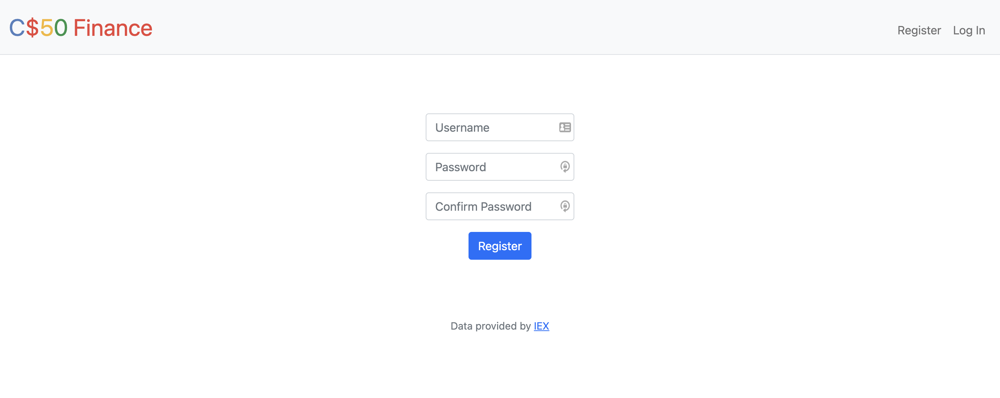
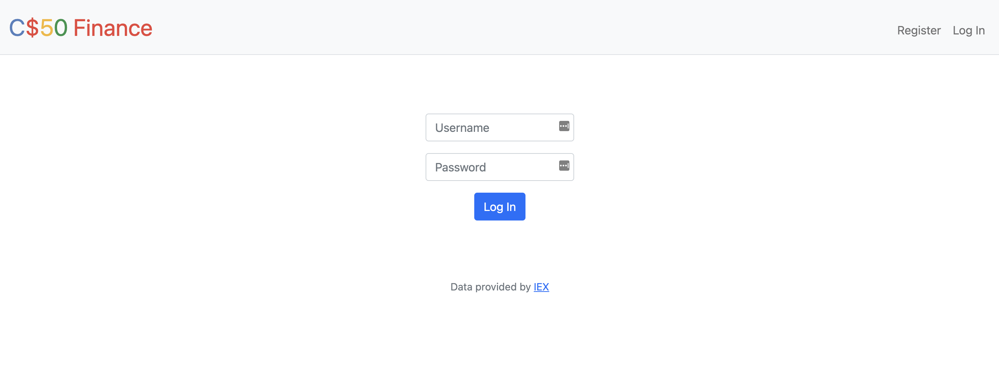
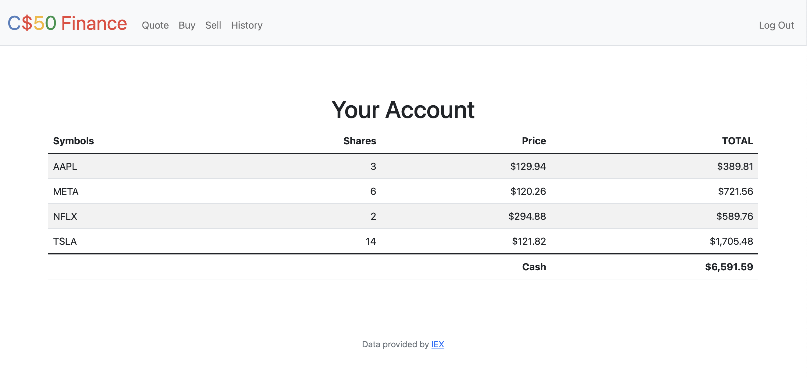
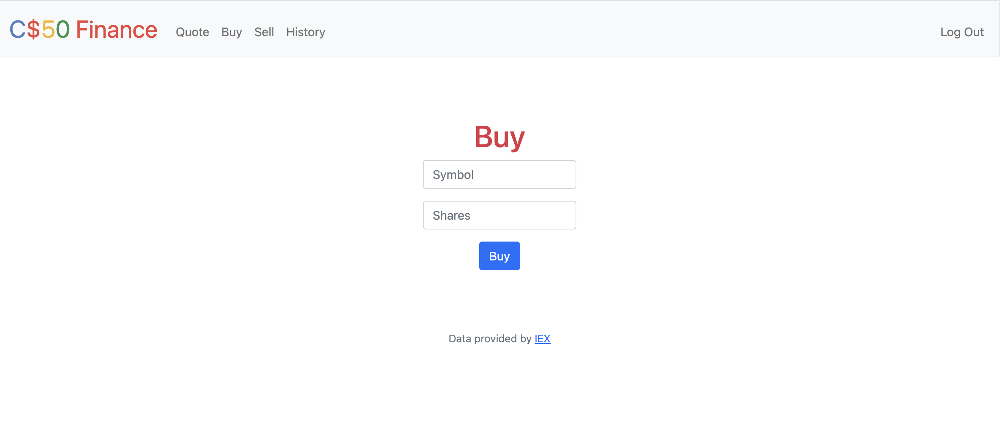
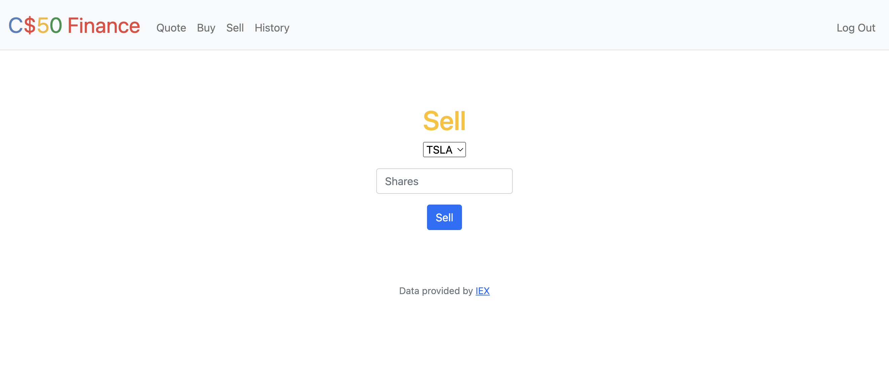

# CS50 Finance (Week9: Problem Set)

## Introduction
This is the one of the exercise from CS50x - Introduction for Computer Science: <a href="https://cs50.harvard.edu/x/2023/psets/9/finance/">Exercise detail</a>

The exercise proposes the following:
* Implement a web application that enables the user to "buy" and "sell" stocks, following the criteria below:
* Complete the implementation of **register** in such a way that it allows a user to register for an account via a form.
* Complete the implementation of **quote** in such a way that it allows a user to look up a stock’s current price.
* Complete the implementation of **buy** in such a way that it enables a user to buy stocks.
* Complete the implementation of **sell** in such a way that it enables a user to sell shares of a stock (that he or she owns).
* Complete the implementation of **index** in such a way that it displays an HTML table summarizing, for the user currently logged in, which stocks the user owns, the numbers of shares owned, the current price of each stock, and the total value of each holding (i.e., shares times price). Also display the user’s current cash balance along with a grand total (i.e., stocks' total value plus cash).
* Complete the implementation of **history** in such a way that it displays an HTML table summarizing all of a user’s transactions ever, listing row by row each and every buy and every sell.

###Personal Touch

We were instructed to implement at least one personal touch of your choice. I chose to require that the users’ passwords to have some number of letters, numbers, and/or symbols which I implimented via this code in the app.py file. 

    # Check if password meets complexity requirements
        if not re.match(r"^(?=.*[a-z])(?=.*[A-Z])(?=.*\d)(?=.*[@$!%*?&])[A-Za-z\d@$!%*?&]{8,}$", password):
            return apology("password must contain at least one lowercase letter, one uppercase letter, one digit, and one symbol, and be at least 8 characters long", 400)

## Tools:
- Flask for backend development
- HTML for website strcuture 
- Bootstrap & CSS for design
- <a href="https://iexcloud.io/">IEX API</a> to get the stocks valus in real time
- sqlite3 for storing users information (username and hashed password) and the transaction record (bought or sold)

## Website:

Once a user is registered they are allocated $10000 by default.

- Register page:

- Login page:

- Index page (Your account homepage) shows your stock portfolio with stock symbol, shares owned, price paid, and the curent total value as well as your remaining cash balance.  

- Quote page (Provides and input for the stock symbol to check an individual stocks current price info via an api):

- Buy page (Privides an input for a stock symbol and number of shares the user would like to buy):

- Sell page (Provides a drop down menu for the user to select a stock that you have bought and input the number of shares they wish to sell):

- History page (Shows a history for your accounts buying and selling):

