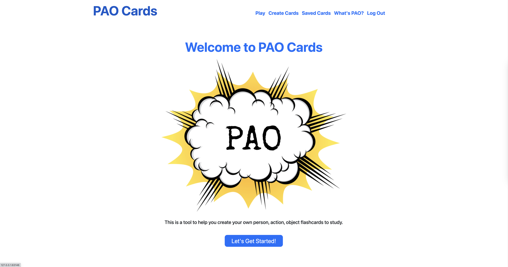

# **PAO Cards: Mastering Memory with the Person-Action-Object System**

### Video Demo: https://youtu.be/1ZBIkUQGAX8

### [Try out the live version of PAO Cards yourself here: https://bliss.pythonanywhere.com/](https://bliss.pythonanywhere.com/)

## **Description:**
This web app project is my final submission to Harvard CS50's Introduction to Computer Science course. See the “About CS50” section below for more information about this course.

PAO Cards is a web application designed to help users improve their memory skills by using the Person-Action-Object (PAO) system. The PAO system is a widely accepted technique for mastering the memorization of long random numbers and playing card decks used by memory champions around the world. By grouping cards together into unique images and storing them in memory palaces, users can easily recall them at a later time.

This application is built using a combination of programming languages and frameworks, including Python with the Flask web framework, Jinja for page rendering, HTML for markup, SQL for data storage, and JavaScript for additional functionality. Styling is done using Bootstrap and custom CSS.

The main structure of the application is built using Flask, which allows for the creation of web applications using Python and Jinja. Data is stored in a SQLite database, consisting of three tables: a user table for storing user information, a standard cards table for storing information about the standard deck, and a custom cards table for storing user-created PAO parameters for each card. Additionally, the flask.url_for() method was used to dynamically generate URLs throughout the application, making it easier to change or update the URLs without hardcoding them.

### **Technologies used:**
- Python
- Flask
- Jinja
- HTML
- SQL
- JavaScript
- Bootstrap
- CSS

### **Mnemonic (Memory) resources:**

- [USA Memory Champion Nelson Dellis PAO explainer video](https://youtu.be/5M8qSWk97gA) 
- [How to Create a PAO Mnemonic System](https://artofmemory.com/wiki/Person-Action-Object_(PAO)_System/#learning-your-pao-system-images)

### **About CS50**

CS50 is an introduction to the intellectual enterprises of computer science and the art of programming. This course covers the fundamental concepts of computer science and teaches students to think algorithmically and solve problems efficiently. Students will learn to design and implement software using a variety of programming languages, including C, Python, SQL, and JavaScript. The course also covers the historical and social context of computer science, and encourages students to think critically about the impact of technology on society. Whether you're a beginner looking to learn the basics of programming or an experienced developer wanting to expand your skills, CS50 is the perfect course to jumpstart your journey in the world of computer science.
